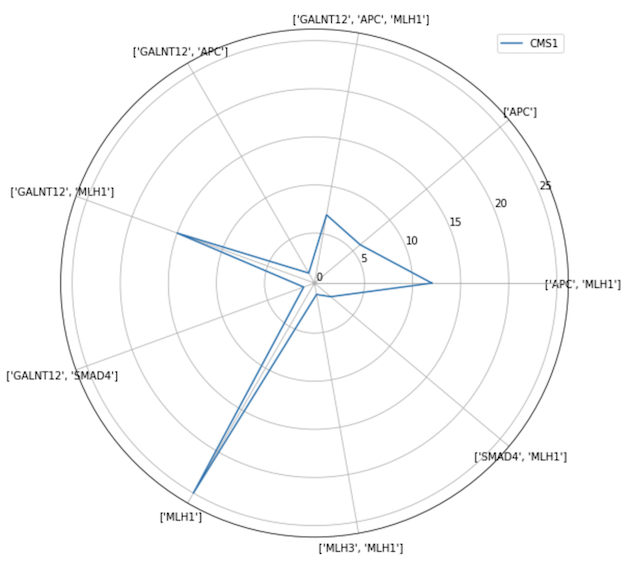

# Abstract

There is an impressive number of data and code reproducibility initiatives, both within Europe and across the world. To motivate researchers to use this amazing infrastructure, we must show the translational research community that the aforementioned initiatives are able to drive change in translational science. Here we demonstrate that using public datasets, it is reasonable to build a pipeline for proposal and validation of driver mutation and subtype-specific colorectal cancer medications. While all three molecular, clinical and chemical name harmonization were necessary, open data and code initiatives, while varied in their approaches, made this project possible.

# Introduction and Methods

Consensus molecular subtypes (CMS) for colorectal cancer were first established in 2015 [@Guinney2015-gy].  Since then, many studies have corroborated this work, showing both clinical validity and differential treatment efficacy in the respective subtypes [@Ten_Hoorn2022-kf; @Mooi2018-up; @Li2020-mi; @Mooi2018-up; @Allen2018-oe].  We have taken the transcriptional pathways that characterize specific molecular subtypes and crossed them with the network perturbations cited for approved drugs in the SigCom LINCS [@Evangelista2022-nh] - a project designed to test how particular small molecules (often approved by the FDA) affect transcriptional networks.  Doing this has resulted in a list of normalized associative counts of small molecules that may be specifically effective for particular colorectal cancer subtypes (see **Table 1**).  We have extended this analysis to predict treatment for particular canonical expression changes within  given subtypes.  We have now built a validation engine for these hits, integrating RNA-seq data with clinical outcomes after pharmacological intervention in the disease [@Liu2018-ro; @Del_Rio2017-jd].  In addition, we are able to further train this validation engine by looking at drugs with which the participants were treated and how effective those drugs were (months total survival).  We are currently extending this validation engine to incorporate recent clinical trial results from Europe and the United States.  Given the molecular scores based on pathway analysis and the theoretic scores from both clinical trials and RWE/EMR analysis (UK Biobank and elsewhere), we intend to build a learning knowledge graph integrating futher molecular and clinical trial information semi-automatically.  Overall, we believe that this is a demonstration that porting federated data from a variety of diverse public sources can have translational applicability, in this case to a number of high-mortality cancers. 

# Results

Work on this project was initially done on the DNAnexus platform, although it should be portable to any command-line based or gui/command-line hybrid bioinformatics ecosystem.  It is available on GitHub at [Disease Subtyping 2022](https://github.com/collaborativebioinformatics/Disease_Subtyping_2022).  

To confirm the assertion made by a number of authors that the efficacy of treatment varies based on subtypes of patients [@Okita2018-lb; Stintzing2019-ux; Stahler2021-vj], we have performed survival analysis on the colorectal patients stratified by subtypes and treatment groups.  First, subtyping of colon cancer patient data was performed using the CMScaller algorithm [@Del_Rio2017-jd]. This algorithm uses Nearest Template Prediction [@Tothill2008-hy] to classify colon cancer expression profiles into predefined subtypes.  Subtyped patients were then stratified by CMS and treatment groups for survival analysis. Data preprocessing, algorithm application and survival analysis code can be found on the [Disease Subtyping 2022 GitHub page](https://github.com/collaborativebioinformatics/Disease_Subtyping_2022) in the [cmscaller_pipeline](https://github.com/collaborativebioinformatics/Disease_Subtyping_2022/tree/main/cmscaller_pipeline) folder and in the [scripts](https://github.com/collaborativebioinformatics/Disease_Subtyping_2022/tree/main/scripts) folder. The survival analysis function allows the user to input subtype and treatment group(s) for comparison, and returns the overall survival of such patient with that specific subtype and treatment. This analysis showed that patients with CMS4 that received bevacizumab, fluorouracil, leucovorin, and irinotecan survied longer than those who received only fluorouracil, leucovorin, and irinotecan. On the other hand, patients with CMS1 who received bevacizumab, fluorouracil, leucovorin, and irinotecan survived shorter than those who received only fluorouracil, leucovorin, and irinotecan. This result provides further support for the previous assertion that subtyping can increase the efficacy of treatment. This survival analysis platform can be used to determine which commonly used treatments are best suited for a particular subtype of colon cancer patients.  

\
**Figure 1.** Survival analysis curve for patients with CMS4 who received either bevacizumab, fluorouracil, leucovorin, and irinotecan (red line) or fluorouracil, leucovorin, and irinotecan (blue line).

\
**Figure 2.** Survival analysis curve for patients with CMS1 who received either bevacizumab, fluorouracil, leucovorin, and irinotecan (red line) or  fluorouracil, leucovorin, and irinotecan (blue line).

To further refine this approach to precision medicine, we built a method to perform an RNA-seq or microarray analysis on colon cancer data searching for differentially over- or underexpressed genes that have been demonstrated in the literature [@Buechler2020-xw] to be associated with different subtypes of colorectal cancer.  Our method also analyzes 12 different reported driver genes for colorectal cancer [@Smit2020-ic], and associates them with various subtypes.  For the purposes of this manuscript, we show the top driver genes (or combination there of) for particular subtypes, outlined in the radar plots shown in **Figures 3a-d**.  

\
**Figure 3a.** Top driver genes (or their combinations) for CMS1.

\
**Figure 3b.** Top driver genes (or their combinations) for CMS2.

\
**Figure 3c.** Top driver genes (or their combinations) for CMS3.

\
**Figure 3d.** Top driver genes (or their combinations) for CMS4.

The results of the analysis were used to generate drug recommendations based on enzymes involved in those pathways and to find their inhibitors or activators. A quantitative molecular score was then generated for those results (see **Table 1**).  The drug recommendations were then evaluated for clinical tolerance and indications of efficacy, generating a quantitative score from those metrics.  The absolute number of {colorectal cancer OR colon cancer} AND {drug name} mentions (Google Scholar) were first divided by mentions of the drug name with cancer to determine a 'cancer specificity index'.  To be clear, we did not necessarily assume that cancer drugs were the only effective 'off-label' therapeutics for colorectal cancer. A separate frequency index was calculated by dividing the absolute number of mentions by the frequency of searches on the indexable Internet.  Additional categorical factors were assigned: whether the drug appeared in any clinical trial, whether the drug was approved, whether the drug was already in use as an adjuvant or chemotherapeutic, and whether there had been an onoging research on the drug.  These scores were standardized using the scikit.learn package and averaged to create an overall index score.  Those with a calculable score are shown in **Table 1**. We intend to reverse this process to analyze the potential efficacy of drugs that are 'on-label' and in clinical trials.  Additionally, we intend to improve these scores by including data about adverse events and by collecting enough data to appropriately weight the components of score when they are averaged.       

**Table 1**: Standardized scores for predicted therapeutic compounds ranked by specificity, evidence support, and approval status.

| Predicted therapy   | CRC specificity score | Evidence score | Approved |
|:---------------------:|:----------------------:|:---------------:|:---------:|
| Sirolimus           |                 0.523 |          0.855 |      1.0 |
| Birinapant          |                 0.512 |          0.252 |      0.0 |
| Licarbazepine       |                 0.321 |          0.500 |      1.0 |
| Y27632              |                 0.297 |          0.250 |      0.0 |
| Gliquidone          |                 0.294 |          0.500 |      1.0 |
| Bendamustine        |                 0.292 |          0.799 |      1.0 |
| Rituximab           |                 0.286 |          1.000 |      1.0 |
| Clofibrate          |                 0.260 |          0.500 |      1.0 |
| Fenofibrate         |                 0.258 |          0.502 |      1.0 |
| Bezafibrate         |                 0.256 |          0.500 |      1.0 |
| U0126               |                 0.253 |          0.000 |      0.0 |
| SB-590885           |                 0.251 |          0.000 |      0.0 |
| Apafant             |                 0.049 |          0.000 |      0.0 |
| CI-1040 (PD-184352) |                 0.024 |          0.250 |      0.0 |
| BRD-A90543464       |                 0.000 |          0.000 |      0.0 |
| BRD-K12707269       |                 0.000 |          0.000 |      0.0 |

  
  
While validating the drugs, we found that some putative driver mutations (e.g. MLH1) introduced compounds with a high molecular score to be a 'noise', by the metrics produced above.  We believe this happened because of the collision between the information space of the interactions of the involved pathways (in this case DNA repair) and other drugs targeted at eukaryotic pathogens.  When we build our intended learning system, we will take this kind of information into account in order to calculate molecular scores for colorectal cancer subtypes, as well as for other cancer types.  The clinical learning system will be expanded to incorporate more real world evidence, both from rigorous and updatable searches of clinical trial data, as well as from large scale biobanks (such as the UK Biobank) specifically on the UK Biobank Research Analysis Platform (UKBRAP) in that case.  To that end, we have provided [a notebook](https://github.com/collaborativebioinformatics/Disease_Subtyping_2022/blob/emerson-edits/generate_synonyms.ipynb) for generating synonyms for the drug names we find to be relevant in colorectal cancer treatment.  The synonyms include publically available data [@Khaleel2022-ko] and synonyms for combination therapies generated as a part of literature review.  These synonyms were used to normalize patient treatment data used in our analysis.
  
We have made the entire pipeline semi-automatic, such that it may be implemented for other cancer types with definable CMS, such as bladder [@McConkey2018-nd], small cell lung cancer [@Rudin2019-qr] or ovarian cancer [@Tothill2008-hy]. 

The immediate next step for this project is to combine our pipeline with the observational multi-drug pipeline in a subtype dependent way.  We believe this will give the oncology research community the best suggestions for precision delivery of drug combinations.  
  
Overall, the entire workflow creates a link between the colorectal cancer subtype from which a specific patient is suffering, and a drug or a small list of drugs that may be specifically effective in the treatment of individual patients.  

# Discussion

We have created a basic validation platform for driver mutation and subtype-specific drug predictions for colorectal cancer.  There are four general directions in which we would like to expand the project.  First, having a more automated data import and metadata harmonization pipeline for transcriptional and clinical data, leveraging modern data sharing and management techniques.  Second, developing a semantic web-based learning system off the back of this analysis, such that scores can be continually refined as more biobanks, clinical trials and RWE comes online. 
Third, developing a proteomic and a DNA-based methods for CMS subtyping that can be leveraged as clinical diagnostics.  Fourth, expanding this analysis to other cancer types that have identified CMS, such as ovarian, bladder and small cell lung cancer.  

## Relevant datasets

#### Proteomics

CPTAC (Clinical Proteomic Tumor Analysis Consortium)\
  https://proteomic.datacommons.cancer.gov/pdc/
  
The Human Protein Atlas
  https://www.proteinatlas.org
  
#### Clinical Trials

EU Clinical Trials Registry
  https://www.clinicaltrialsregister.eu
  
US Clinical Trials Registry
  https://clinicaltrials.gov

#### Cancer Datasets

TCGA (The Cancer Genome Atlas)\
  https://www.cell.com/cell/fulltext/S0092-8674(18)30229-0
  
UCSC Xena
  http://xena.ucsc.edu

#### SRA dataset list

See files:
  [data/SRR_Acc_List_cms{x}.txt](https://github.com/collaborativebioinformatics/Disease_Subtyping_2022/tree/main/data)

#### Biobanks 

UK Biobank
  https://ukbiobank.dnanexus.com

#### Imaging repositories

TCIA (The Cancer Imaging Archive)\
  https://wiki.cancerimagingarchive.net/display/Public/CT+COLONOGRAPHY

## Tools

SUMO (subtyping tool for multi-omic data): https://github.com/ratan-lab/sumo

MultiPLIER (unsupervised transfer learning approach for rare disease transcriptomics): \
https://github.com/greenelab/multi-plier

Boruta (R package for feature selection): https://www.jstatsoft.org/article/view/v036i11

## Acknowledgements

The results <published or shown> here are in whole or part based upon data generated by the TCGA Research Network: https://www.cancer.gov/tcga. 

BB would like to thank Shirley P for discussions leading to the start of this project, and this work is dedicated to her memory.
  
Special thanks to the Organizers of the BioHackathon Europe 2022!

## Grant Information 
 
DNAnexus generously sponsored compute for this project.  

## References

